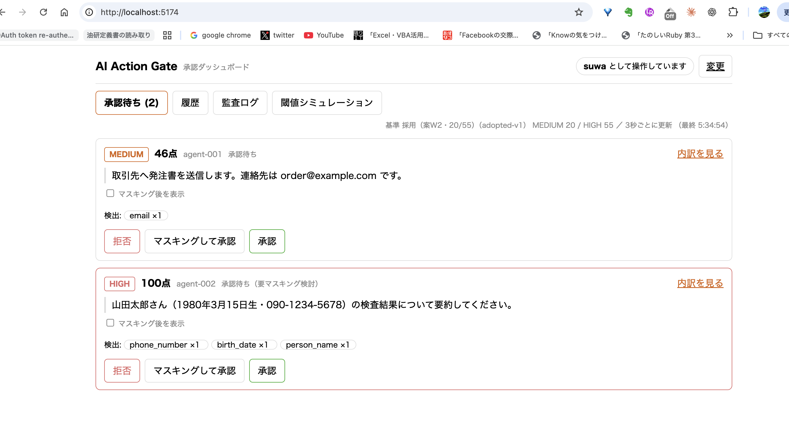
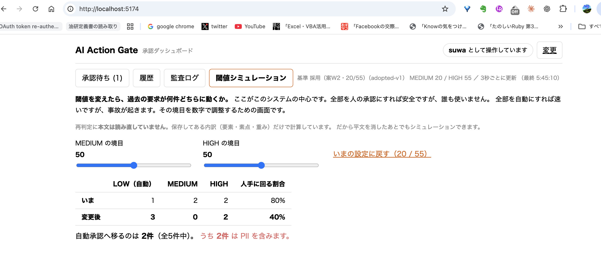
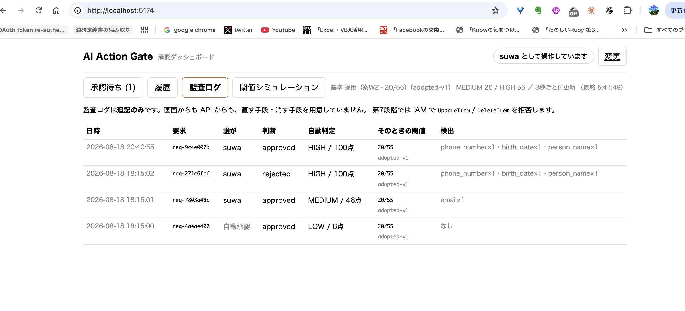
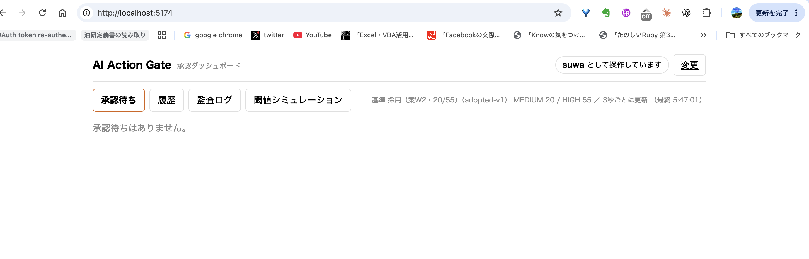

# AI Action Gate

AIエージェントが危険な操作を実行する前に、**いったん止めて人間が承認する**仕組み。

要求を受けて、PIIを検出し、リスクを 0〜100 で採点し、**2つの閾値で三分岐**する。
LOW は自動承認、MEDIUM と HIGH は承認待ちキューへ回る。

Rust（判定エンジンとAPI）/ Svelte（承認ダッシュボード）/ AWS（実行基盤）。

> **この README は、なぜそう作ったかを書いたものです。**
> 第8段階まで完了しています。AWS 上で動かして確認したあと、**その日のうちに削除しました**
> （[実行の記録](infra/evidence/aws-run.txt)・[削除の確認](infra/evidence/teardown.txt)）。

---

## 動かし方

必要なものは **Rust 1.97 以上**と、ダッシュボードを動かすなら **Node 22 以上**。
第5段階まではDBも外部サービスも要りません。

```bash
cargo test                      # 104件。サーバもDBも立てずに全部通る
cargo run -p gate-api           # http://127.0.0.1:8090（メモリに保存）
```

DynamoDB に保存する場合（第6段階）。

```bash
docker compose up -d            # DynamoDB Local（ポート 18000）
GATE_STORE=dynamodb GATE_DYNAMO_ENDPOINT=http://localhost:18000 \
  AWS_ACCESS_KEY_ID=local AWS_SECRET_ACCESS_KEY=local AWS_REGION=ap-northeast-1 \
  GATE_POLICY=policies/adopted.toml cargo run -p gate-api

# DB が要る試験は明示的に呼ぶ（cargo test に Docker を要求しないため）
GATE_DYNAMO_ENDPOINT=http://localhost:18000 AWS_ACCESS_KEY_ID=local \
  AWS_SECRET_ACCESS_KEY=local AWS_REGION=ap-northeast-1 \
  cargo test -p gate-store -- --ignored --test-threads=1
```

承認ダッシュボードは別の端末で。

```bash
cd dashboard && npm install && npm run dev    # http://localhost:5173

# AWS 上の API に向ける場合（向け先は vite.config.js の1か所だけ）
GATE_API=https://xxxx.lambda-url.ap-northeast-1.on.aws npm run dev
```

**画面に API の場所を焼き込んでいません。** 開発サーバのプロキシ経由で行くので、
ローカルから AWS へ向け先を変えたときの変更は `vite.config.js` の3行で済みました。

疑似エージェントから要求を投げます。

```bash
cargo run -p gate-agent -- send --scenario low      # 自動承認される
cargo run -p gate-agent -- send --scenario medium   # 承認待ちになる
cargo run -p gate-agent -- send --scenario high     # マスキング案つきで承認待ち
cargo run -p gate-agent -- send --scenario high --wait   # 承認が下りるまで待つ
cargo run -p gate-agent -- status req-33dc4d77
```

ポートは 8090。8080 は別プロジェクトが使っているためずらしてあります（`GATE_ADDR` で変更可）。

### curl で叩く

CLI だけだと API の形が見えないので、生の形を置いておきます。

**① エージェントが要求を投げる**

```bash
curl -s -X POST http://127.0.0.1:8090/api/requests \
  -H 'content-type: application/json' \
  -d '{
    "agent_id": "agent-001",
    "action": "send_external",
    "destination": "external_ai",
    "data_class": "personal_information",
    "payload": { "text": "山田太郎さん（1980年3月15日生・090-1234-5678）の検査結果について" }
  }'
```

```json
{
  "request_id": "req-33dc4d77",
  "decision": "pending",
  "risk": "HIGH",
  "score": 100,
  "detected": [
    { "kind": "phone_number", "count": 1, "lowest_confidence": "high" },
    { "kind": "birth_date",   "count": 1, "lowest_confidence": "high" },
    { "kind": "person_name",  "count": 1, "lowest_confidence": "high" }
  ],
  "masked_preview": "○○○○さん（○○○○年○月○○日生・○○○-○○○○-○○○○）の検査結果について",
  "conclusive": true,
  "raised_by_uncertainty": false
}
```

**② 承認待ちを見る**（スコアの内訳とマスキングプレビューが入っています）

```bash
curl -s http://127.0.0.1:8090/api/queue
```

**③ 承認する**（`X-Approver-Id` が無いと 401）

```bash
curl -s -X POST http://127.0.0.1:8090/api/requests/req-33dc4d77/decision \
  -H 'content-type: application/json' \
  -H 'X-Approver-Id: suwa' \
  -d '{"verdict": "approve_masked"}'      # approve / approve_masked / reject
```

**④ エージェントが結果を取りに行く**

```bash
curl -s http://127.0.0.1:8090/api/requests/req-33dc4d77
```

```json
{
  "request_id": "req-33dc4d77",
  "status": "approved_masked",
  "risk": "HIGH",
  "score": 100,
  "payload": "○○○○さん（○○○○年○月○○日生・○○○-○○○○-○○○○）の検査結果について",
  "reviewer": "suwa",
  "decided_at": "2026-08-17T14:41:14+00:00"
}
```

**⑤ 閾値シミュレーション**

```bash
curl -s -X POST http://127.0.0.1:8090/api/simulate \
  -H 'content-type: application/json' -d '{"medium_at": 80, "high_at": 99}'
```

```
現在   LOW 1 / MEDIUM 1 / HIGH 1   人手に回る割合 67%
変更後 LOW 2 / MEDIUM 0 / HIGH 1   人手に回る割合 33%
→ 自動承認が 1件 増えます。うち PII を含むものが 1件
```

**⑥ 監査ログ**

```bash
curl -s http://127.0.0.1:8090/api/audit
```

---

## 技術の選定理由

3つとも「使ってみた」ではなく、**そこはそれでなければ成立しない**という形で選んでいます。

### Rust — 判定エンジンとAPI

**速いから、ではありません。エージェントの実行を止めている間の待ち時間だからです。**

この仕組みは、エージェントが危険な操作をする前に**必ず通る場所**にあります。
承認ゲートが遅ければ、エージェント全体が遅くなります。しかも、通るのは危険な要求だけでは
ありません。**自動承認される LOW も、同じ経路を通ります。**

そして**処理量が読めません**。PII 検出は本文の全体に正規表現を走らせるので、
本文の長さに比例します。実測するとこうなります。

| 本文の長さ | 判定1回（検出＋採点） |
|---|---|
| 60字 | **0.004 ms** |
| 約1KB | 0.039 ms |
| 約54KB（上限に近い） | 2.8 ms |

```bash
cargo run --release -p gate-lab --example bench   # 上の数字を測り直せます
```

**上限いっぱいの本文でも 3ms 弱**で、そのぶん Lambda の実行時間も短く済みます
（費用の見積もりで 30ms と置いたのは、DynamoDB の往復を含めた値です）。

GC を持つ言語だと、この「読めない処理量」に**停止時間の揺れ**が乗ります。
ゲートは全リクエストが通る場所なので、揺れがそのまま全体に出ます。
Rust を選んだのは、**最悪値が読めること**が、平均が速いことより効く場所だからです。

もう1つあります。**判定を純粋関数にできたのは、Rust の型が効いています。**
`gate-core` の依存に `tokio` も `aws-sdk` も入れていないので、I/O が混ざったら
コンパイルが通りません。「うっかり時刻を見る」ができない形になっています。
これが無いと、閾値シミュレーションの「同じ入力なら必ず同じ点」が守れません。

### Svelte — 承認ダッシュボード

**承認する人の集中力が、このシステムの弱点だからです。**

誤検出が続くと、承認する人は画面を流し読みするようになります。そうなると、本物が
出たときに見逃します。だから画面は「速く出る」より「**読める**」ことを優先しました。

- スコアの**内訳**（要素・素点・重み・なぜその点か）をその場で開ける
- マスキング後の表示に**切り替えられる**（承認する前に、伏せた形を確かめられる）
- 確信度の低い検出は**点線で区別**する
- 「◯◯として操作しています」を**常時表示**する

Svelte を選んだのは、**この規模で仮想DOMもストア管理も要らない**からです。
状態は「承認待ちの一覧」と「開いている行」だけで、`$state` で足ります。
ビルド後は 59KB（gzip 22KB）で、実行時の依存は Svelte 1つです。

**SvelteKit ではなく Vite + Svelte** にしたのも同じ理由です。
ルーティングもSSRも要らない1画面に、ファイルベースルーティングとサーバランタイムは重すぎます
（仕様書10章「大規模なフロントエンドフレームワークを追加しない」）。

### AWS — 実行基盤

**監査ログを、アプリの善意ではなく IAM で守るためです。**

「このログは消せません」とコードに書いても、それはコードを直せば消せます。
**IAM の Deny は、アプリの外にあります。** アプリを書き換えても、権限を追加しても、
Deny は Allow より強いので抜けられません。

```json
{ "Effect": "Deny",
  "Action": ["dynamodb:UpdateItem", "dynamodb:DeleteItem", "dynamodb:BatchWriteItem"],
  "Resource": ".../table/audit_logs" }
```

`BatchWriteItem` を落とすと、その中に `DeleteRequest` を入れて消せてしまいます。
**「消せないこと」を主張するなら、そこまで塞いで初めて言えます。**

しかもこれは**実行せずに証明できます**。IAM Policy Simulator に聞けば、
そのロールで `DeleteItem` が `explicitDeny` になることを、消しに行かずに確かめられます
（`infra/evidence/iam-simulate-audit.json`）。

サービスの選び方は、この目的から決まります。

| | なぜ |
|---|---|
| **Lambda** | 承認は1日に数件。常時起動するものを置く理由がない。arm64（Graviton）で x86 より約20%安い |
| **DynamoDB** | **TTL がアイテム単位**なので、平文だけを別テーブルに切り出して自動で消せる。条件式で二重承認も弾ける |
| **API Gateway / Function URL** | HTTPS の入口。証明書の管理を持たずに済む |
| **CloudWatch** | ログの保持期間を設定で切れる。溜め続けない |

### SQS を使わなかった理由

**使う判断と同じくらい、使わない判断も説明できるようにしています。**

承認結果は、エージェントが `request_id` で**ポーリングして取りに来る**設計です。
非同期キューを挟んでいません。

理由は、**挟んでも解決するものが無いから**です。SQS が効くのは、処理が重くて
呼び出し側を待たせられないときや、流量を平準化したいときです。この仕組みは:

- 判定そのものは**3ms 未満**（上の実測）。待たせて困る長さではない
- 承認は**人が押すまで**終わらない。キューを挟んでも人は速くならない
- エージェントは結果を知る必要があるので、**どのみち取りに来る**

挟むと、動く部品と失敗する場所が増えるだけです（キューの権限、可視性タイムアウト、
デッドレターキュー、重複配信の扱い）。**プロトタイプに載せる理由がありません。**

**非同期化するなら、こう入れます。** 承認が下りた瞬間に、エージェントへ通知したい場合です。
`decide` の直後に SQS へ `request_id` だけを流し、エージェント側がそれを受けて結果を取りに行く。
**本文はキューに載せません**（平文がもう1か所に増えるため）。
そのときは監査ログに「通知した」も記録します。

---

## 設計判断

### 認証は、意図的に実装していません

承認者は HTTPヘッダ `X-Approver-Id` で名乗るだけです。**誰でも名乗れます。**
プロトタイプとして意図した割り切りで、隠していません。

そのうえで、**差し替えられる形**にしてあります。

- ドメイン層（`gate_core::review`）は `approver_id` を**文字列として受け取るだけ**で、
  それがヘッダから来たのか JWT から来たのかを知りません。
- 取り出しているのは `gate-api/src/approver.rs` の1ファイルだけ。
  Cognito でも JWT でも社内SSOでも、**ここを書き換えれば済みます**。

認証を作らないことと、認証を後から入れられないことは別です。

ただし「誰が承認したか」が空の記録は作れません。`X-Approver-Id` が無ければ **401** で、
承認そのものが通りません。自動承認（LOW）も `system` として監査ログに残します。
空文字で埋めると、あとから「人が承認したのか、自動だったのか」が区別できなくなるためです。

### マスキングは桁数を保持します

`090-1234-5678` → `○○○-○○○○-○○○○`、`1980年3月15日` → `○○○○年○月○○日`。

規則を1つにするためです。「電話番号は桁を残し、日付は潰す」だと規則が2つになり、
**なぜこれはこう伏せたのかを毎回説明することになります。**
区切り記号と単位（年月日）は残し、中身だけを伏せます。

### 「検出できなかった」と「無かった」を型で分けています

```rust
pub enum Scan {
    Scanned { findings: Vec<Finding> },   // 走査した。空なら本当に0件
    NotScanned { reason: SkipReason },    // 走査していない。0件とは言えない
}
```

`Vec<Finding>` ひとつで表すと、**両方とも空配列**になります。そうなると、
いちばん危ない「読めなかった本文」が、いちばん安全な「PIIの無い本文」と
同じ扱いで自動承認されます。

走査していない要求は、点が低くても LOW にしません（`unscanned_floor`）。
閾値シミュレーションでどれだけ緩めても、自動承認には落ちません。

### 氏名の検出には確信度が付きます

日本語の氏名は機械的には確定できません。「田中」は姓でもあり地名でもあります。
そこで、**何を根拠に見つけたか**を残し、その強さを確信度にしています。

| 確信度 | 根拠 | 例 |
|---|---|---|
| High | 敬称、またはラベル | `山田太郎さん` / `氏名：山田太郎` |
| Medium | 姓の辞書 ＋ 直後が名らしい | `山田太郎の検査結果` |
| Low | 形が似ているだけ | `タナカ・タロウ` |

Low を捨てないのは、捨てた瞬間に「無かった」ことになるからです。
承認画面には出し、承認者が「これは人名ではない」と1件だけ外せる形にしてあります。

**このシステムを入れれば個人情報が漏れない、とは言えません。** 検出漏れは原理的に残ります。

### リアルタイム更新に、なぜポーリングを選んだか

承認待ちが増えたら、リロードせずに画面へ出ます。**3秒ごとのポーリング**です。
SSE も WebSocket も使っていません。**どちらも検討したうえで落としました。**

**SSE を落とした理由。** API Gateway（HTTP API / REST API）は**レスポンスのストリーミングに
対応していません**。SSE を通すには Lambda Function URL（`RESPONSE_STREAM`）に寄せることになり、
API Gateway を使う構成から外れます。**ローカルでは動くが本番では動かない**実装を抱えることになります。

**WebSocket を落とした理由。** API Gateway には WebSocket API があるので、これは「使えない」わけでは
ありません。落としたのは**接続管理のコスト**です。Lambda は接続を保持できないので、
`connection_id` を DynamoDB に持ち、切断時に消し、送信のたびに引く必要があります。
テーブルが1つ増え、その掃除の面倒も増えます。**承認待ちが1日に数件という前提には重すぎます。**

**ポーリングで足りる理由。** 承認の発生は不定期かつ低頻度で、3秒の遅れが承認業務を損ないません。
「速いから SSE」ではなく、**遅くて困る場面が無いからポーリングで足りる**、という判断です。

そのうえで、無駄が出ないようにしてあります。

- **ETag で 304 を返します。** 変わっていなければ本文を作らず、JSON 化もマスキングもしません。
  画面側も再描画しないので、開いたまま放置しても点滅しません。

  > **【重要】ETag は転送量を減らしますが、読み取り費用は減らしません。**
  >
  > 第7段階の費用見積もりを作って気づきました。「変わっていない」と答えるためには、
  > 変わっていないことを**確かめる**必要があります。最初の実装はそこで全件 Scan していたので、
  > 304 を返しても DynamoDB の読み取り費用は満額かかっていました。
  > メモリ版では版番号がタダで持てたため、この差が見えていませんでした。
  >
  > いまは版番号を1件の項目で持ち、304 の判定は `GetItem` 1回（0.5 RRU）です。
  > 承認待ちの一覧も Scan をやめ、**承認待ちだけが載る索引**（sparse index）から引きます。
  > 判断が下りると索引から落ちるので、承認済みが何万件たまっても一覧の費用は増えません。
- **間隔はサーバが持ちます**（`GATE_POLL_MS`、既定3秒）。画面に焼き込んでいません。
  304 でも Lambda の呼び出し回数は数えられるので、**間隔がそのまま費用に効きます**。
  第7段階で月額を測ったあと、ここだけを動かして調整できます。

### 平文をいつ消すか — 3つのテーブルで、消し方を分けています

| テーブル | 中身 | 消える？ |
|---|---|---|
| `action_requests` | 判定結果・内訳・そのときの閾値。**平文なし** | 消しません |
| `request_payloads` | 本文（平文）だけ | **消えます**（下記） |
| `audit_logs` | 監査ログ | **消せません**（更新も削除も呼びません） |

**平文と判定結果を同じアイテムに置いていません。** DynamoDB の TTL はアイテム単位で丸ごと消すので、
同居させると内訳も閾値も一緒に消えます。それでは「平文を消したあとでも閾値シミュレーションができる」
という利点が失われます。

**平文の保持期間は、正確にはこうです。**

> **承認完了から24時間で削除対象になります。実際の削除は最大48時間後になることがあるため、
> アプリケーション側で期限切れの平文を返しません。**

DynamoDB の TTL は「期限を過ぎてから通常48時間以内」に削除される仕組みで、
削除されるまでのあいだ Query や Scan の結果に出続けます。
`PayloadStore::get_payload` が読むたびに期限を確かめているのはそのためです。
これが無いと、期限を過ぎた平文が読めてしまいます。

**承認待ちのまま放置されたものは、7日で「期限切れ」として閉じます。**
TTL は判断が下りてから動き出すので、判断が下りない要求には時計が動きません。
閉じた記録は監査ログにも残します。**判断しなかったことも記録です。**
そのため `Verdict` に `Expired` があり、人の「拒否」とは別に扱っています。
どちらも実行はさせませんが、**拒否は人が見て決めたこと、期限切れは誰も見なかったこと**です。

### 判定は I/O から独立しています

`gate-core` の依存に `tokio` も `axum` も `aws-sdk` もありません。混ざったらコンパイルが通りません。

- 判定の試験にサーバもDBも要りません（`cargo test` だけで103件）
- 判定が純粋関数なので、**同じ入力なら必ず同じ点**になります。
  ここに時刻が1つ入った瞬間、「過去の要求を新しい閾値で再判定する」が嘘になります

### 閾値シミュレーションは、本文を読み直しません

スコアの**内訳（要素・素点・重み）を保存**しているので、閾値を変えるのは保存済みの点を
振り分け直すだけ、重みを変えるのも素点に掛け直すだけです。

つまり**平文を消したあとでもシミュレーションできます**。個人情報を持ち続けなくて済みます。

そして「何件動くか」だけでなく、**動いたもののうち PII を含むものが何件か**を必ず出します。
数だけ見て緩めると、緩めてはいけないものが混ざります。

### リスクの重みと閾値は、実測してから決めました

**採用値: 重み 操作20 / 送信先40 / 区分20 / PII20、閾値 MEDIUM 20 / HIGH 55。**

29件のサンプル要求を用意し、重み案4つ・閾値案5つをそれぞれ当てて分布を測ってから選びました。
**重みと閾値は同時に変えていません**。同時に動かすと、差がどちらから来たのか分からなくなるためです。

```bash
cargo run -p gate-lab -- samples      # 比較に使った材料
cargo run -p gate-lab -- weights      # 重み案の比較（閾値は固定）
cargo run -p gate-lab -- thresholds   # 閾値案の比較（重みは固定）
```

選定の理由はコード（`policy.rs` の `Policy::adopted`）に残してあります。要点は3つです。

- **送信先を最も重くした。** 社内の削除はバックアップで戻せる可能性がありますが、
  外部AIに渡った情報は取り返せません。同じ「事故」でも後戻りできるかが違います。
- **MEDIUM を 20 にした。** 25 にすると「データ区分の申告なし」（22点）が自動承認され、
  **区分を申告しないほうが通りやすくなります**。エージェント側から見ると
  「`data_class` を書かなければ通る」抜け道です。悪意がなくても実装の手抜きで発生します。
- **HIGH を 55 にした。** 人手の総数は変わらず（23件のまま）、HIGH が3件から6件に増えるだけです。
  これがないと承認者の選択肢は「拒否」か「そのまま承認」の二択になります。
  伏せて通せると分かっていれば、拒否せずに済む場面が増えます。

材料づくりでも1つ学びがありました。**推奨された 13〜25 の帯に、サンプルが1件もありませんでした。**
そのままでは閾値案3つの結果が完全に一致し、比較になりません。材料に無い帯では案の差が測れないので、
その帯の要求を足してから測り直しています。

---

## AWS 上で動かした記録（第7段階）

**東京リージョンに Lambda + DynamoDB で構築し、3経路を通してから、同じ日に削除しました。**
証跡は `infra/evidence/` に置いてあります。手順は [`infra/DEPLOY.md`](infra/DEPLOY.md)、
削除は [`infra/teardown.sh`](infra/teardown.sh) にあります。

### 画面（データはすべて AWS の Lambda と DynamoDB から来ています）

承認待ち。**右上の「suwa として操作しています」は常時表示**です（後述の[認証の設計](#認証は意図的に実装していません)）。



閾値シミュレーション。**このシステムの中心**です。MEDIUM の境目を 20 → 50 に上げると、
46点の2件が人の承認を通らなくなります。**そのうち2件が PII を含む**ことまで警告に出ます。



監査ログ。**そのときの閾値（20/55）と、判定した基準の版（adopted-v1）が各行に残ります。**
あとから閾値を変えても、過去の判断が「どの基準で下されたか」は動きません。



承認者IDを入れていない状態。**API が 401 を返すので、誰が承認したか空の記録は作れません。**



### 3経路の通し

`aws lambda invoke` を10回。全文は [`infra/evidence/aws-run.txt`](infra/evidence/aws-run.txt) です。

| | 内容 | 点数 | 結果 |
|---|---|---|---|
| LOW | 社内の読み取り・PIIなし | **6** | 自動承認。監査ログに `reviewer: system` で残る |
| MEDIUM | 社外への書き込み・メールアドレス1件 | **46** | 承認待ち → `suwa` が承認 |
| HIGH | 外部AIへ個人情報（電話・生年月日・氏名） | **100** | 承認待ち＋マスキング案 → `suwa` が拒否 |

**点数はローカルの実行と完全に一致しました。** 判定が I/O から独立しているので、
保存先がメモリでも DynamoDB でも結果が変わりません。

二重承認は **HTTP 409**。DynamoDB の条件式（`attribute_not_exists(decided_at)`）で弾いています。
アプリ側で「取ってから確かめて書く」would-be 競合を作らず、書き込みの原子性に寄せました。

### 監査ログが消せないことを、実行せずに証明する

`aws iam simulate-principal-policy` で、Lambda 実行ロールが `audit_logs` に対して何をできるかを
IAM 自身に答えさせました（[`iam-simulate-audit.json`](infra/evidence/iam-simulate-audit.json)）。

```
dynamodb:PutItem            allowed        ← 追記はできる
dynamodb:Query              allowed        ← 読める
dynamodb:GetItem            allowed
dynamodb:UpdateItem         explicitDeny   ← 直せない
dynamodb:DeleteItem         explicitDeny   ← 消せない
dynamodb:BatchWriteItem     explicitDeny   ← まとめても消せない
dynamodb:DeleteTable        explicitDeny   ← テーブルごとも消せない
dynamodb:UpdateTimeToLive   explicitDeny   ← TTL を付けて消させることもできない
```

**`explicitDeny` は「権限を与え忘れている」ではなく「明示的に禁じてある」です。**
あとから広い Allow を足しても覆りません。ここが `implicitDeny` との違いで、
「運用でうっかり権限を広げた」ときに効きます。

**`BatchWriteItem` と `UpdateTimeToLive` を含めたのが要点です。**
`DeleteItem` だけを拒否しても、`BatchWriteItem` の中に `DeleteRequest` を入れれば消せます。
TTL も同じで、消す権限が無くても「30秒後に消える」設定を書けば消せてしまいます。
**削除は1つの API 名ではありません。**

コード側にも削除の経路が無いことを [`no-delete-in-code.txt`](infra/evidence/no-delete-in-code.txt) に残しました。

### 見積もりと違ったところ — API Gateway を使いませんでした

**下の見積もりは API Gateway 前提ですが、実際は Lambda Function URL にしました。**

1画面・1関数で、API Gateway の機能（複数ルートの束ね・オーソライザ・スロットリング・
ステージ）を1つも使いません。**使わないものを間に挟むと、料金だけでなく設定と障害点が増えます。**

結果として、見積もりで唯一「13ヶ月目から課金が始まる」と書いた項目が消えました。
Function URL にはリクエスト課金がなく、Lambda の呼び出し料金に含まれます。

| | 見積もり（API Gateway） | 実際（Function URL） |
|---|---|---|
| 12ヶ月以内 | 約 $0.05/月 | 約 $0.05/月 |
| 13ヶ月目以降 | 約 $0.3/月 | **約 $0.05/月のまま** |

### 詰まったところ

**プロトタイプでも、AWS に載せた時点で新しい失敗が3つ出ました。** 全部残しておきます。

**① 起動と同時にテーブルを作ろうとして落ちた（`Runtime.ExitError exit status 2`）**

ローカル開発の都合で、API は起動時に `ensure_tables()` を呼んでいました。
Lambda の実行ロールには最小権限しか渡していないので `CreateTable` が拒否され、
起動そのものが失敗しました。

**直したのはロールではなくアプリです。**

```rust
// AWS 上のテーブルはデプロイ手順が作る。
// Lambda のロールには CreateTable も ListTables も渡していない（最小権限）。
if std::env::var("AWS_LAMBDA_FUNCTION_NAME").is_err() {
    gate_store::ensure_tables(&client).await?;
}
```

ロールに `CreateTable` を足せば5秒で直りますが、**それはアプリの都合で権限を広げること**です。
テーブルを作るのは構築の作業であって、実行時の仕事ではありません。

**② ロググループができず、ログの保持期間を設定できなかった**

`logs:CreateLogGroup` をロールに入れ忘れていました。足しても直らず、
**関数の設定を1つ更新して実行環境を作り直させたら**、初回の呼び出しでロググループができました。
Lambda の実行環境は起動時に取得した認証情報を使い回すので、
**ロールを直しても、動いている実行環境にはすぐ反映されません。**

**③ Function URL が 403 を返し続けた**

`AuthType=NONE` にして、`Principal: "*"` の resource-based policy も入れているのに
`AccessDeniedException` が返る状態が続きました。最終的に、**statement-id を変えて
同じ権限を入れ直したら通りました。**

**原因は特定できていません。** 関数を削除したあとなので、これ以上は追えません。
ただ、切り分けが遅れた理由ははっきりしています。**作業用ユーザに `lambda:GetPolicy` を
入れていなかったため、「いま実際に効いているポリシー」を最後まで読めませんでした。**
最小権限で始めたこと自体は正しいのですが、**壊れたときに中を見るための読み取り権限は、
最初から入れておくべき**でした。

この間も、`aws lambda invoke` で関数が正常に動くことは確認できていました。
**URL は入口であって、確かめたいものではありません。** 通し確認を invoke で組んであるのは、
入口の設定に確認手順が巻き込まれないようにするためです。

---

## AWS の想定月額（第7段階のデプロイ前）

### 前提

**前提なしの金額は意味がないので、先に書きます。**

| 前提 | 値 | 備考 |
|---|---|---|
| 実行要求 | **30件/日** | デモと動作確認。実運用ではない |
| 承認者 | **1人** | |
| ダッシュボードを開いている時間 | **1日8時間 × 月20日** | **ここが効きます** |
| ポーリング間隔 | **3秒**（`GATE_POLL_MS`） | |
| リージョン | ap-northeast-1（東京） | |
| 保存されている要求 | 50件 | 読み取り費用がここに比例します |

### 費用は「要求の件数」では決まりません

3秒間隔で画面を開いたままにすると、**1時間で1,200リクエスト**。8時間で9,600、月20日で
**192,000リクエスト**です。承認待ちが1日3件でも、この数字は変わりません。

**費用を決めるのは「画面を開いている時間 × 保存件数」です。**

| 内訳 | 月あたりのリクエスト |
|---|---|
| ダッシュボードのポーリング（承認待ちタブ） | 192,000 |
| 疑似エージェント（要求30件/日 ＋ 結果の取得） | 約 5,000 |
| **合計** | **約 197,000** |
| （参考）履歴・監査タブを開いたままにすると | 約 581,000 |

最後の行は、いまの画面が承認待ち以外のタブでは3つのAPIを叩くためです。

### サービスごと

| サービス | 数量 | 12ヶ月以内 | 13ヶ月目以降 |
|---|---|---|---|
| **Lambda** | 197,000回 × 30ms × 128MB ＝ 約740 GB秒 | **$0**（常時無料: 100万回・40万GB秒） | $0 |
| **API Gateway**（HTTP API） | 197,000リクエスト | **$0**（**12ヶ月無料**: 100万/月） | **約 $0.24** |
| **DynamoDB** 書き込み | 約5,400 WRU | 約 $0.01 | 約 $0.01 |
| **DynamoDB** 読み取り | 約 605万 RRU | **約 $1.72** | 約 $1.72 |
| **DynamoDB** 保存 | 1MB未満 | $0（25GBまで常時無料） | $0 |
| **CloudWatch Logs** | 約 59MB | $0（5GBまで常時無料） | $0 |
| **データ転送** | 約 0.4GB | $0（100GB/月まで無料） | $0 |
| **合計** | | **約 $1.8/月** | **約 $2.0/月** |

**無料枠は2種類あります。** Lambda と DynamoDB と CloudWatch は**常時無料**の枠ですが、
**API Gateway は12ヶ月無料**です。1年後に課金が始まります（上表の右列）。

DynamoDB のオンデマンドには注意があります。**無料枠の「25 WCU / 25 RCU」はプロビジョンドモード専用**で、
オンデマンドには適用されません。1リクエスト目から課金されます（金額は上表のとおり小さい）。

### 主役だった DynamoDB の読み取りは、設計を直して消しました

**見積もりを作って、実装の弱点が1つ出ました。**

最初の実装は、ポーリング1回ごとに `action_requests` を **Scan** し、件数ぶん
`request_payloads` を **GetItem** していました。**保存件数に比例して増える**構造です。
ETag で 304 を返す道でも、変わっていないことを確かめるために同じ Scan をしていました。

| 保存件数 | 直す前（月額） | 直したあと |
|---|---|---|
| 20件 | 約 $0.7 | |
| 50件 | 約 $1.7 | **約 $0.03** |
| 100件 | 約 $3.4 | 約 $0.03 |
| 500件 | 約 $17 | 約 $0.03 |

直したのは2点です。

1. **版番号を1件の項目で持つ。** 304 の判定が `GetItem` 1回（0.5 RRU）になりました
2. **承認待ちを索引（sparse index）から引く。** 判断が下りると索引から落ちるので、
   承認済みがいくら溜まっても一覧の費用は増えません

金額の問題というより、**保存件数に比例する設計をそのままデプロイしない**、という判断です。

### 直したあとの合計

| | 12ヶ月以内 | 13ヶ月目以降 |
|---|---|---|
| 前提どおり（画面8時間 × 月20日） | **約 $0.05/月** | **約 $0.3/月** |
| 履歴タブを開いたまま | 約 $0.1/月 | 約 $0.8/月 |

13ヶ月目以降に増えるのは、API Gateway の12ヶ月無料が切れるためです。

### CloudWatch Logs の保持期間

**既定は「無期限」です。** 設定しないとログが溜まり続け、静かに課金されます。
**7日**を明示的に設定します（デプロイ手順に含めます）。

```bash
aws logs put-retention-policy --log-group-name /aws/lambda/gate-api --retention-in-days 7
```

---

## 止め方（実行済み）

**このプロジェクトは実績づくりで、運用しません。** 動作確認とスクリーンショットが済んだ日に止めました。

```bash
bash infra/teardown.sh
```

消すコマンドを並べただけのスクリプトにはしていません。**消えたことを1件ずつ確認して、
出力を [`infra/evidence/teardown.txt`](infra/evidence/teardown.txt) に残します。**
「消したつもりで残っていた」が、この手のいちばんよくある事故だからです。

消したもの。

| | 消し忘れると |
|---|---|
| Lambda 関数と Function URL | 呼ばれれば課金。URL は推測しにくいだけで秘密ではない |
| DynamoDB 3テーブル | 保存が課金対象（25GBまでは無料） |
| **ロググループ `/aws/lambda/gate-api`** | **Lambda を消しても残る。消し忘れの定番** |
| IAM ロールとポリシー | 課金はされないが、権限が残る |
| 作業用ユーザのアクセスキー | 無効化。削除ではないので、必要なら戻せる |

残したものが2つあります。

- **予算アラート（$5 / $8）** — 無料で、消し忘れに気づく最後の砦になる
- **IAM ユーザ `gate-deployer`** — キーだけ無効化。作り直す手間を省くため

スクリプトに `set -e` を付けていないのは、**「すでに無い」も正常だから**です。
途中で止めず最後まで流して、確認結果を全部残すほうが目的に合います。

---

## 構成

```
crates/
  gate-core/   判定。PII検出・スコアリング・マスキング。I/Oを持たない
  gate-api/    axum の HTTP API。受け取って渡すだけ
  gate-agent/  疑似エージェント CLI（本物のAIエージェントは作らない）
  gate-lab/    案を実測で比べる道具（重み・閾値の選定に使った）
  gate-store/  置き場。メモリ版と DynamoDB 版（平文は別テーブル）
dashboard/     承認ダッシュボード（Vite + Svelte）
policies/      採用された設定
```

ダッシュボードは **SvelteKit ではなく Vite + Svelte** です。
ルーティングもSSRも要らない1画面なので、仕様書10章「大規模なフロントエンドフレームワークを
追加しない」に沿ってこちらにしました。

## 完成条件

仕様書12章の19項目。**確かめ方を添えてあります。** 「動きました」だけでは検収できないためです。

| | 条件 | 確かめ方 |
|---|---|---|
| ✅ | 疑似エージェントからのJSONで、判定から承認まで通る | `cargo run -p gate-agent -- send --scenario high --wait` |
| ✅ | LOW / MEDIUM / HIGH の3経路がすべて動作する | [`aws-run.txt`](infra/evidence/aws-run.txt)（AWS 上・6/46/100点） |
| ✅ | リスクスコアの内訳が表示される | 画面「内訳を見る」／`GET /api/queue` の `components` |
| ✅ | PIIが検出され、マスキングプレビューが出る | [`queue.png`](infra/evidence/queue.png)・`masked_preview` |
| ✅ | 氏名の検出に確信度が付いている | `Confidence::{High,Medium,Low}`。敬称・ラベル／姓辞書／形のみで分ける |
| ✅ | 「検出できなかった」と「無かった」が型で分かれている | `Scan::Scanned` / `Scan::NotScanned` |
| ✅ | 閾値を変えると、過去の要求の分岐がシミュレーションできる | [`simulate.png`](infra/evidence/simulate.png) |
| ✅ | 閾値・重みが設定として外出しされている | `policies/adopted.toml`（`GATE_POLICY` で差し替え） |
| ✅ | 監査ログが更新・削除できない（IAMで拒否） | [`iam-simulate-audit.json`](infra/evidence/iam-simulate-audit.json)（5件 `explicitDeny`） |
| ✅ | 監査ログに「そのときの閾値」が残っている | [`audit.png`](infra/evidence/audit.png)（各行に `20/55` と `adopted-v1`） |
| ✅ | 監査ログに平文のPIIが残っていない | 監査ログは**種別と件数だけ**。平文は別テーブル（`request_payloads`） |
| ✅ | 判定ロジックがI/Oから独立し、単体テストで完結する | `gate-core` は tokio も aws-sdk も依存に持たない。`cargo test` |
| ✅ | ダッシュボードがリアルタイムに更新される | 3秒ポーリング＋ETag/304（`GATE_POLL_MS`） |
| ✅ | AWS上で動作する | [`aws-run.txt`](infra/evidence/aws-run.txt)（10回の invoke がすべて成功） |
| ✅ | AWS認証情報がコードに直書きされていない | 実行時は IAM ロール。ローカルは環境変数 |
| ✅ | 実在の個人情報・企業名がサンプルに含まれていない | 氏名は架空、メールは `example.com`、電話は `090-1234-5678` |
| ✅ | README に Rust・Svelte・AWS それぞれの選定理由が書かれている | [技術の選定理由](#技術の選定理由) |
| ✅ | README に SQS を使わなかった理由が書かれている | [SQS を使わなかった理由](#sqs-を使わなかった理由) |
| ✅ | GitHubへpushしていない（承認前） | ローカルの git のみ |

## 進捗

- [x] 第2段階：判定コア（I/Oなし）
- [x] 第3段階：Rust API（インメモリ）
- [x] 第4段階：スコアリング基準の選定（実測して採用）
- [x] 第5段階：Svelte ダッシュボード
- [x] 第6段階：DynamoDB 永続化と監査ログ
- [x] 第7段階：AWS へのデプロイ（**確認後、同日に削除済み**）
- [x] 第8段階：通し確認と README 仕上げ

**ここで完成です。** 仕様書13章のとおり、決済・本物のエージェント・Bedrock 接続・
複数テナント・通知・SQS・認証基盤の作り込みには着手していません。

サンプルに出てくる氏名・電話番号・生年月日・企業名は**すべて架空**です。
